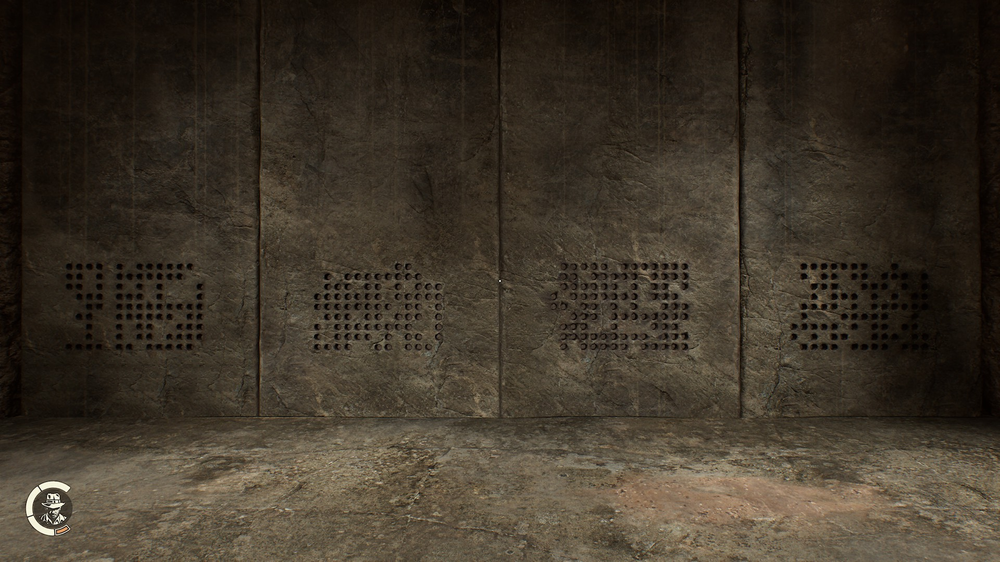
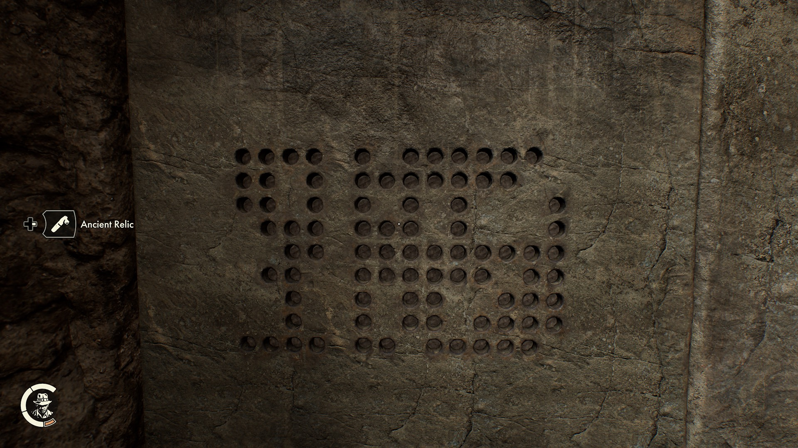
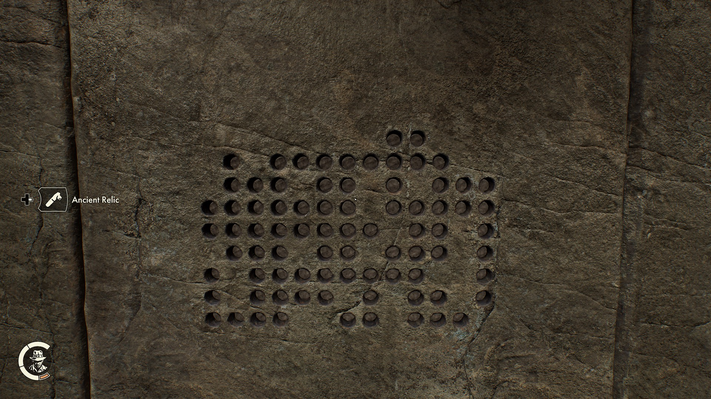
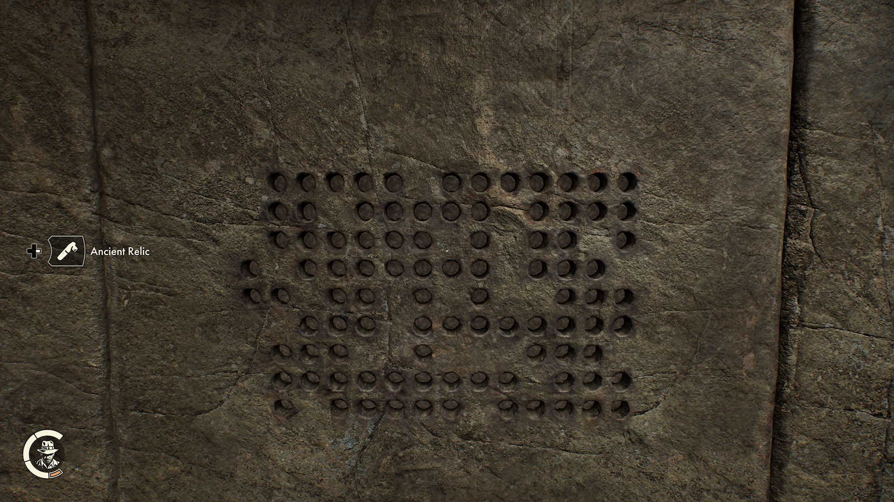
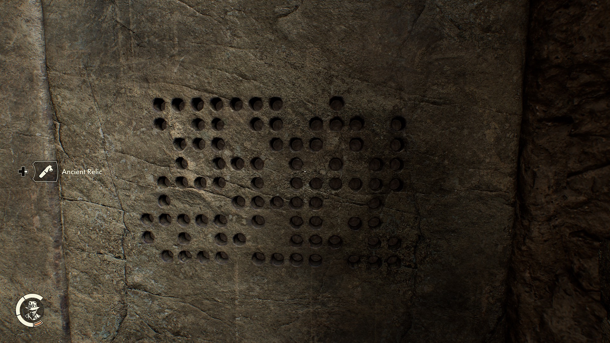

# Indiana Jones and the Great Circle Puzzle Solver
This is a puzzle solver for the ancient relic puzzles in the game Indiana Jones and the Great Circle!


## Ancient Relic Puzzle Overview
Throughout the game you collect ancient relics: 


These relics can be used in 3 locations throughout the game on logic puzzles that use the ancient relics to fill in a grid. Turning relics in different ways on the grid fill in areas differently. Here is an example of the first puzzle that can be found in Gizeh, Egypt:


This puzzle can be represented as a grid with 8 rows and 4 columns. Here is such a grid where 0 represents a slot that is not activated, 1 represents a slot that is activated, and . represents the lack of a slot:

```
00..
00..
0000
000.
.0..
000.
.000
.0..
```

In the image all the slots are activated but for the purpose of the example, all of the slots are deactivated (marked as 0).

## Mechanics
To fill in the puzzle, you have to insert one of the relics into a slot. From there you have two options:

1. Turn the relic left to fill all 8 slots surrounding it
2. Turn the relic to the right to fill in all slots in the same row and column until it hits a wall (spot without a slot)

### Examples
Here is an empty 5x5 puzzle filled with inactive slots to show visually how the above mechanics work:

```
00000
00000
00000
00000
00000
```

Here is the same puzzle state with a relic turned to the right in the middle:
```
00000
01110
01R10
01110
00000
```

Once again here is the same puzzle state with a relic turned to the left in the middle:
```
00100
00100
11L11
00100
00100
```

The least number of relics you can use to solve this puzzle is 3. Here is one of the ways to solve the 5x5 with only 3 relics

Here is the same puzzle state with a relic turned to the right in the middle:
```
L1111
11111
11R11
11111
1111L
```
In this solution the relics turned to the left (marked as "L") activate all slots around the perimeter, while the relic in the middle turned to the right activates the remaining slots on the inside.

## The Ziggurat Puzzle
The last of the three puzzles take place in a ziggurat (a temple) in Iraq. Inside the ziggurat there is an ancient relic puzzle that takes up a whole wall and is comprised of 3 9x14 grids and one 9x13 grid. Because of it's size it is very hard to solve by hand.

Here is what the entire puzzle looks like:


Luckily the puzzle is broken up into 4 parts instead of being one continuous puzzle. This means that for the sake of runtime we can solve each part as its own individual puzzle.

Part 1: 


Part 2:


Part 3: 


Part 4: 


With infinite relics these puzzles would be trivial, but there are only 50 ancient relics hidden throughout the entire game. This means that you only have 50 relics to solve all 4 of these puzzle. The goal of this project is to be able to solve the Ziggurat puzzles with 50 or less relics.