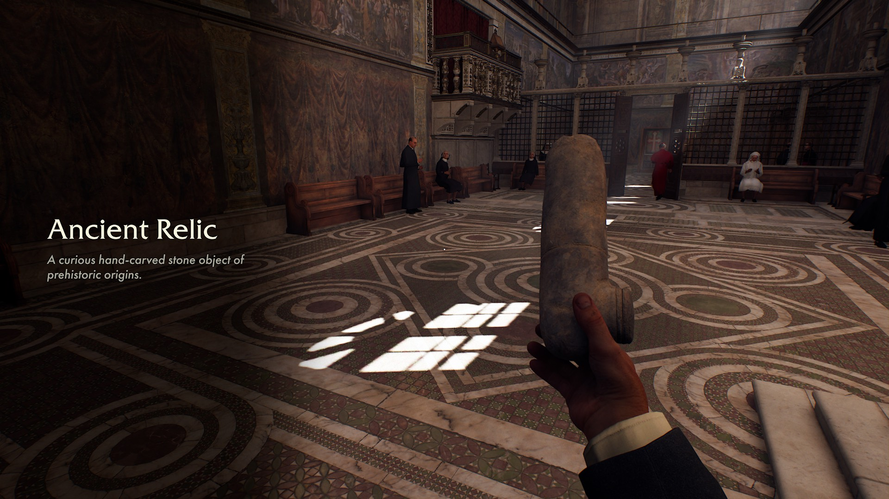
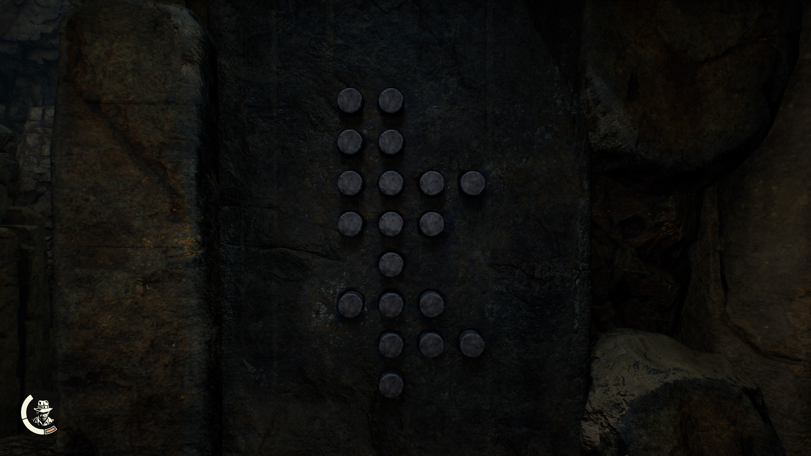

# Indiana Jones and the Great Circle Puzzle Solver
This is a puzzle solver for the ancient relic puzzles in the game Indiana Jones and the Great Circle!


## Ancient Relic Puzzle Overview

Throughout the game you collect ancient relics: 



At 3 different points in the game there are logic puzzles that use the ancient relics to fill in a grid. Here is an example of the first puzzle that can be found in Gizeh, Egypt:



The puzzle can also be represented as a grid with 4 columns and 8 rows. Here is such a grid where 0 represents a slot that is not activated, 1 represents a slot that is activated, and . represents the lack of a slot:

```
11..
11..
1111
111.
.1..
111.
.111
.1..
```

In this example all of the slots are activated, that's because in the picture it is already solved. But let's say that they were all empty, which is how the puzzle usually starts. How would you fill it in?

## Mechanics

Insert one of the relics into a slot. From there you have two options:

1. Turn the relic left to fill all 8 slots surrounding it
2. Turn the relic to the right to fill in all slots in the same row and column until it hits an empty slot